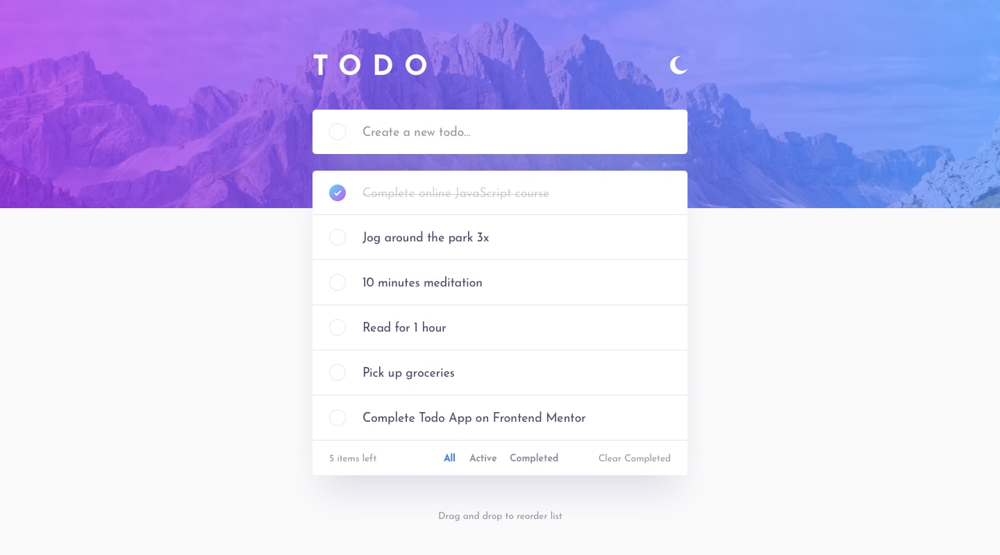

# Frontend Mentor - Todo app solution

This is a solution to the [Todo app challenge on Frontend Mentor](https://www.frontendmentor.io/challenges/todo-app-Su1_KokOW). Frontend Mentor challenges help you improve your coding skills by building realistic projects. 

## Table of contents

- [Overview](#overview)
  - [The challenge](#the-challenge)
  - [Screenshot](#screenshot)
  - [Links](#links)
- [My process](#my-process)
  - [Built with](#built-with)
  - [What I learned](#what-i-learned)
  - [Continued development](#continued-development)
  - [Useful resources](#useful-resources)
- [Author](#author)


## Overview

### The challenge

Users should be able to:

- View the optimal layout for the app depending on their device's screen size
- See hover states for all interactive elements on the page
- Add new todos to the list
- Mark todos as complete
- Delete todos from the list
- Filter by all/active/complete todos
- Clear all completed todos
- Toggle light and dark mode
- **Bonus**: Drag and drop to reorder items on the list

### Screenshot




### Links

- Solution URL: [https://github.com/AcharaChisomSolomon/todo-app](https://github.com/AcharaChisomSolomon/todo-app)
- Live Site URL: [https://unrivaled-halva-b0c404.netlify.app/](https://unrivaled-halva-b0c404.netlify.app/)

## My process

### Built with

- Semantic HTML5 markup
- CSS custom properties
- JavaScript
- Flexbox
- Mobile-first workflow
- [React](https://reactjs.org/) - JS library
- [Emotion](https://emotion.sh/docs/introduction) - For styles


### What I learned

Learned how to incorporate CSS variables to enable DRY principles in responsiveness and dealing with color themes.

```css
@media (min-width: 550px) {
      --font-size-header: calc(40rem / 16);
      --font-size-body: calc(18rem / 16);
      --font-size-input: calc(18rem / 16);

      --input-padding-y: calc(20rem / 16); 
      --input-padding-x: calc(24rem / 16);

      --circle-size: calc(26rem / 16);
      --spacing-header: calc(70rem / 16);
      --spacing-3xl: calc(24rem / 16);
    }
  }

  /* Dark Theme Override */
  [data-theme="dark"] {
    --bg-primary: var(--bg-dark);
    --bg-secondary: var(--bg-card-dark);
    --text-primary: var(--text-dark);
    --text-secondary: var(--text-muted-dark);
    --border-color: var(--border-dark);
    --text-completed-color: var(--text-completed-dark);
    
    /* Override shadows for dark theme */
    --shadow-light: var(--shadow-light-dark);
    --shadow-medium: var(--shadow-medium-dark);
    --shadow-strong: var(--shadow-strong-dark);
    --shadow-hover: var(--shadow-hover-dark);
  }
```

Will have to study styled components indepth, noticed there was a lot of repetition in some places.

### Continued development

Plan to update with localstorage so that the data persists even when the window is closed.

### Useful resources

- [UI DEV](https://ui.dev/c/react) - This helped me become really comfortable with react.
- [CSS FOR JS](https://courses.joshwcomeau.com/css-for-js) - This deepened my mental model of CSS.


## Author

- Frontend Mentor - [@AcharaChisomSolomon](https://www.frontendmentor.io/profile/AcharaChisomSolomon)
- Twitter - [@Chisom14Solomon](https://x.com/Chisom14Solomon/highlights)


